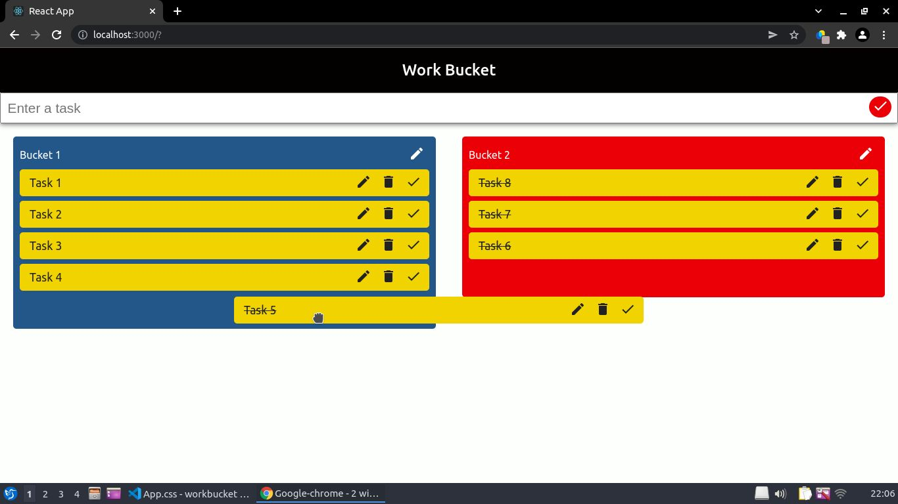
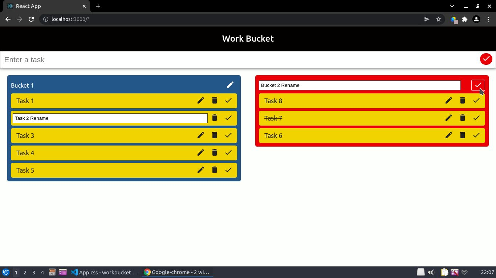
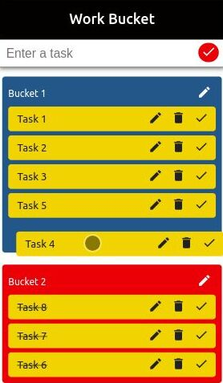

# WorkBucket
**WorkBucket** is a [Trello](https://trello.com/) inspired mini project management web app.

### Description
This app consists of two buckets. Each bucket holds a collection of multiple tasks. A user can rename the buckets according to his or her needs and move tasks from one bucket to another via a drag and drop mechanism.

### Project Purpose
The purpose of this project is to demonstrate how can a person:
* Develop React.js apps using TypeScript.
* Implement Drag and Drop Functionality in App.
* Make responsive design using CSS properties like flexbox and media queries.

Yes, you read that right! The app works great on mobile devices too! :) 
  

#### Technologies Used
* React.js: A library that makes it really easy for us to create web pages with advanced UI.
* Typescript: A language that lets you strictly define data types for all the variables and objects in your code and hence saves you from a lot of errors and makes it easy to scale your app in future.
* React Drag And Drop: You can think it of an abstract code that lets you easily define draggable and droppable objects in your app. Using this, you can easily implement drag and drop mechanism in your app. To use this in your project, simply write <q> npm i react-beautiful-dnd </q> and refer to the [docs](https://github.com/atlassian/react-beautiful-dnd#:~:text=react%2Dbeautiful%2Ddnd%20is%20a,beautiful%20drag%20and%20drop%20experience.) to learn how use it in your app.

## Contact
For any queries, you can mail me at developerishant710@gmail.com

